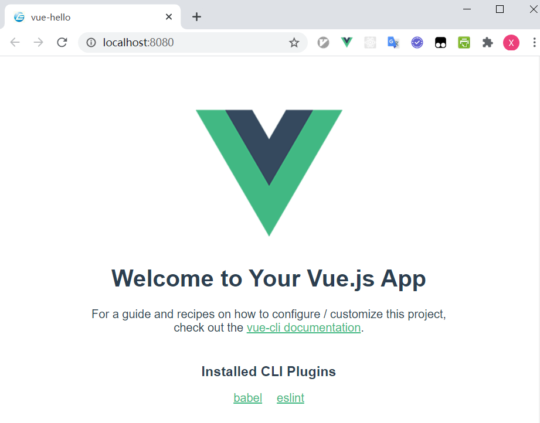
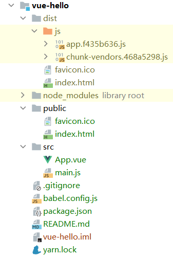

# Vue基础

[toc]

## 前后端分离

* 原来的前后端不分离，系统的显示与逻辑耦合在一起
* 手机为代表的移动终端的出现，导致多个客户端（前端）对应同一服务端（后端）的需求
  * 淘宝：网页端，Android，iOS
* 前后端分离后
  * 后端提供逻辑，前端提供数据显示与交互
  * 便于接入新的客户端
  * 前后端可由不同的团队独立开发，采用不同的技术与框架
  * 前端通过调用后端的接口（API）获取数据
  * 前端拿到数据后进行渲染显示

## 第一个 Vue 应用

* 前提：安装 Nodejs，Chrome，IDEA

* 新建 IDEA 工程：

  * 点击 File -> New -> Project
  * 在弹出的对话框中左侧导航条中选择 JavaScript
  * 然后在右侧选择 Vue.js，点击 Next
  * 输入项目名：vue-hello
  * 点击 Finish
  * IDEA 会自动生成项目

* 项目结构

  * node_modules：用于存放项目依赖包
  * public：
  * src
    * assets
    * components
    * App.vue
    * main.js
  * .gitignore
  * package.json

* 运行项目

  * 打开 package.json

  * 点击 "serve": "vue-cli-service serve"

    

  * 待启动成功后，观察控制台的输出

  * 打开浏览器，输入 http://localhost:8080，应该会看到如下内容

    

## 修改应用

* 删除 App.vue 所有内容

* 将 App.vue 的内容替换为

  ```vue
  <template>
    <div>
      <h4>Counter: {{ counter }}</h4>
      <button v-on:click="increase">点一次加1</button>
    </div>
  </template>
  <script>
  export default {
    data() {
      return ({
        counter: 0
      })
    },
    methods: {
      increase() {
        this.counter++;
      }
    }
  }
  </script>
  ```

* 打开浏览器，执行效果为

  

## 部署应用

* 为使应用最小化，可以删除 `src\components` 以及 `src\assets` 目录

* 打开 package.json，点击 build 前面的绿色按钮，然后选择 "run build"

  

* build 结束后，将会在工程根目录下多出一个 dist 目录

  

* dist 目录里包含了完整的、优化且压缩过的应用代码
* 可以将这里 dist 目录里的代码部署到 HTTP 服务器上
  * 下载 nginx：http://nginx.org/en/download.html
  * 把下载后的 zip 文件解压到任意目录，比如 `D:\nginx`
  * 把 dist 目录下的文件复制到 nginx 安装目录下的 html 目录
  * 双击 nginx 安装目录下面的 nginx.exe 启动服务器
  * 打开浏览器，输入 http://localhost
  * 可以看到与之前本地完全相同的运行结果

## 单页应用

* SPA：Single Page Application